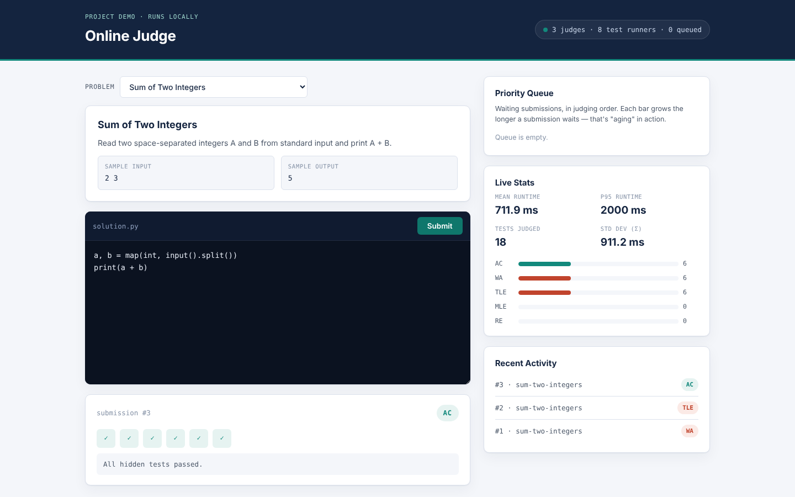

# Online Judge — Code Evaluation & Judging Platform

[](https://github.com/pistachiokhunafa/online-judge-platform/actions/workflows/ci.yml)


A small but real online judge, like a mini Codeforces or LeetCode backend.
Submitted Python code actually runs in a sandboxed process against hidden
test cases and gets a verdict (**AC / WA / TLE / MLE / RE**). You can watch
every submission move through the pipeline in the browser:
**queue → schedule → judge in parallel → verdict → stats**.



## Features

- **Priority scheduling with aging**: cheap submissions jump ahead, but no
  submission waits forever. This is done with a plain binary heap and no
  re-sorting (see `scheduler.py`).
- **Parallel judging**: each submission's test cases fan out across a
  shared thread pool and the results are combined into one verdict.
- **Sandboxed execution**: time, memory, CPU, output and file-handle limits,
  process-group cleanup, and an optional fully isolated **Docker** mode.
  See [Security model](#security-model).
- **Live stats**: mean, standard deviation and P50/P95/P99 runtime, plus a
  count of each verdict.
- **Abuse limits**: request and code size caps, queue back-pressure,
  bounded memory, and a `Host` allowlist.
- **45 automated tests**, run by GitHub Actions on Linux and macOS for
  Python 3.9 and 3.12.

## Running it

Requires Python 3.9+ and Flask.

```bash
pip install -r requirements.txt
python3 run.py
```

Then open **http://127.0.0.1:5050**, pick a problem, edit the solution and
hit **Submit**.

To run every submission inside a locked-down container (recommended if anyone
other than you will submit code), install Docker and start the judge with:

```bash
docker pull python:3.12-slim
JUDGE_SANDBOX=docker python3 run.py
```

There is also a standalone command-line demo with no web UI:
`python3 examples/online_judge_cli.py`.

## Running the tests

```bash
pip install -r requirements-dev.txt
python3 -m pytest
```

The tests cover:

- **Scheduler:** ordering, aging and thread safety.
- **Sandbox:** every verdict, plus the abuse cases: infinite loops, forked
  background processes, memory bombs, output floods, environment leakage
  and temp-file cleanup.
- **Judge:** the full judging pipeline.
- **Stats:** the percentile maths.
- **HTTP API:** input validation, size limits, `Host` checks, security
  headers and a full end-to-end submission.

## Project layout

```
online-judge-platform/
├── run.py                       entry point: `python3 run.py`
├── requirements.txt             runtime dependency (Flask)
├── requirements-dev.txt         + pytest
├── backend/
│   ├── app.py                   Flask routes + security middleware (no judging logic)
│   └── engine/
│       ├── models.py            Submission, TestCase, Verdict: the "nouns"
│       ├── scheduler.py         priority-queue heap + aging
│       ├── sandbox.py           runs untrusted code (local or Docker backend)
│       ├── judge.py             fans test cases out, reduces results in
│       ├── stats.py             mean / stdev / P50 / P95 / P99
│       ├── problems.py          the 3 built-in problems + hidden tests
│       └── service.py           wires it all together + background workers
├── frontend/                    index.html, style.css, app.js (no framework)
├── examples/online_judge_cli.py standalone command-line version
├── tests/                       pytest suite
└── .github/workflows/ci.yml     CI: tests on Linux + macOS
```

To understand the system, read the files in the order a submission flows
through it: `models.py` → `scheduler.py` → `sandbox.py` → `judge.py` →
`service.py` → `app.py` → `app.js`.

## How a submission moves through the system

1. **Browser → `POST /api/submissions`**: `app.py` validates the request
   and hands the code to `JudgeService.submit()`, which wraps it in a
   `Submission` and pushes it onto the `PriorityScheduler` heap. The
   response comes back immediately with a `submission_id`.
2. **Scheduling**: background "submission worker" threads pop the
   highest-priority submission off the heap. Priority is
   `P = wait_time − penalty`. Ranking by that is the same as ranking by
   `submitted_at + penalty`, which never changes, so a plain min-heap gives
   aging for free.
3. **Judging**: `judge.py` parses the code once (the serial step), then
   fans the hidden test cases out across a shared thread pool (the parallel
   step) and combines the results into one verdict.
4. **Sandboxing**: each test case runs the code in its own sandboxed
   process (`sandbox.py`). This is the only file that talks to the OS.
5. **Stats**: every test result is recorded in `StatsTracker`, which
   powers the Live Stats panel.
6. **Polling**: the frontend polls `GET /api/submissions/<id>` until the
   verdict is final, and polls `GET /api/dashboard` every second.

## Security model

Running untrusted code is the hard part of any online judge, so here is
exactly what is and isn't protected.

**Local sandbox (default, `JUDGE_SANDBOX=local`)**

- Each test runs in a fresh private temp directory (mode `0700`) that is
  deleted afterwards. It uses an isolated interpreter (`python -I -S`)
  and an empty environment, so no API keys or tokens are inherited.
- Each test gets its own **process group, and the whole group is killed**
  at the time limit and again after a normal exit. A submission can't
  escape the limit by forking background processes.
- These rlimits apply: memory (`RLIMIT_AS`, Linux only), CPU seconds,
  output size (1 MB), open files and core dumps. Output is written to
  capped files, not unbounded pipes.
- **Limitation:** the code still runs as your user, so it can read your
  files and use the network. Use local mode only for code you trust,
  such as your own.

**Docker sandbox (`JUDGE_SANDBOX=docker`)**

- Each test runs in a throwaway container with:
  - `--network none` and `--read-only`
  - `--cap-drop ALL` and `no-new-privileges`
  - an unprivileged user (`65534`)
  - memory and swap caps
  - `--pids-limit` (no fork bombs)
  - one CPU
- The submission's directory is mounted read-only.
- CI checks the generated `docker run` command, but the GitHub runners
  don't execute containers. Run a Docker smoke test locally before relying
  on it.

**Web/API layer (`app.py`)**

- **`Host` allowlist:** only `127.0.0.1`, `localhost` and `[::1]` are
  accepted. This blocks **DNS-rebinding** attacks, where a malicious website
  makes your browser talk to this local server. Add hostnames with
  `OJ_ALLOWED_HOSTS=judge.example.com`.
- **Size limits:** request bodies over 128 KB and code over 64 KB are
  rejected (`413`).
- **Queue limits:** the queue is capped at 100 (`503` when full), and only
  the latest 1000 submissions are kept in memory.
- **Security headers:** a strict Content-Security-Policy, `nosniff`,
  `X-Frame-Options: DENY` and `no-referrer`.
- **Input validation:** submissions must be JSON with string fields, so
  cross-site form posts are rejected.
- **No XSS:** the frontend never inserts untrusted text as HTML. Output
  and errors are shown with `textContent`.
- **No answer leaks:** a Wrong Answer never shows the hidden expected
  output.

**Not production-ready yet:** there are no user accounts, authentication
or per-user rate limiting. The server is Flask's development server; use
gunicorn behind a reverse proxy for real traffic. The hidden tests live in
`problems.py` for the demo; a real judge would load them from storage that
isn't public.

## Design choices

- **All tests run, even after a failure,** so the UI can show a full
  "5 of 6 passed" grid. The CLI version cancels the remaining tests on the
  first failure to save compute. Same engine, different trade-off.
- **The priority penalty is a simple heuristic** based on code length,
  to make queue ordering visible in a demo. A real judge would estimate it
  from past execution data.
- **There are two thread pools:** `submission_workers` (the *c* in the
  queueing stability condition ρ = λ / (cμ)) and a shared
  `test_case_pool` (the *n* in Amdahl's Law).
- **Adding a language** would only mean changing the command in
  `sandbox.py`; nothing else in the engine depends on Python.

## License

MIT. See [LICENSE](LICENSE).
